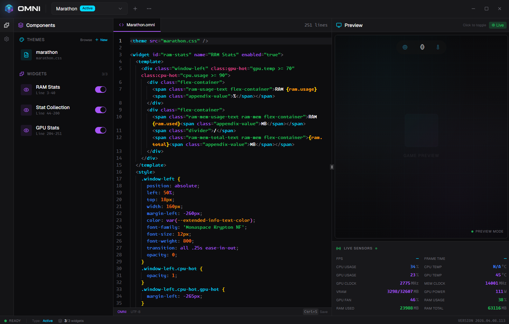

<p align="center">
  
</p>

A customizable game overlay for Windows. Build overlays with HTML and CSS, see real-time hardware metrics, and display them on top of any game.

----



## Features

- **Visual Overlay Editor** — Write overlays using a familiar HTML/CSS syntax in a Monaco-powered editor with full CSS and HTML intellisense
- **Real-Time Metrics** — FPS, frame time, CPU/GPU usage, temperatures, VRAM, RAM, clock speeds, and fan speed
- **Live Preview** — See your overlay update in real-time as you edit, with live sensor data or simulated values
- **Per-Game Overlays** — Assign different overlays to different games, or use a single default
- **Anti-Cheat Compatible** — External overlay fallback for protected games (Valorant, CS2, Apex, etc.)
- **Conditional Styling** — Change colors and classes based on metric thresholds (e.g., red text when GPU temp > 80)
- **CSS Animation Support** — Leverage CSS keyframes, transitions, to create unique interactive overlays.
- **Feather Icons** — Full icon set available for use in overlays
- **Theme System** — Create reusable CSS themes and share them across overlays
- **Auto-Updates** — Silent background updates with one-click install
- **Minimal Footprint** — Lightweight host process with configurable sensor polling intervals

## Installation

Download the latest installer from [GitHub Releases](https://github.com/djowinz/omni/releases/latest).

Run `OmniSetup.exe` and follow the prompts. Omni installs to `Program Files` and optionally starts with Windows.

### Requirements

- Windows 10/11 (64-bit)
- Administrator privileges (required for hardware sensor access)

## Quick Start

1. Launch Omni from the Start Menu
2. Open the editor and write your overlay using HTML and CSS
3. Use `{sensor.path}` placeholders to display live metrics (e.g., `{fps}`, `{gpu.temp}`, `{cpu.usage}`)
4. Press **F12** in-game to toggle the overlay

### Available Sensors

| Path | Description |
|------|-------------|
| `{fps}` | Frames per second |
| `{frame-time}` | Frame time (ms) |
| `{cpu.usage}` | CPU usage (%) |
| `{cpu.temp}` | CPU temperature |
| `{gpu.usage}` | GPU usage (%) |
| `{gpu.temp}` | GPU temperature |
| `{gpu.clock}` | GPU core clock (MHz) |
| `{gpu.vram.used}` | VRAM used (MB) |
| `{gpu.vram.total}` | VRAM total (MB) |
| `{gpu.power}` | GPU power draw (W) |
| `{ram.usage}` | RAM usage (%) |
| `{ram.used}` | RAM used (MB) |
| `{ram.total}` | RAM total (MB) |

### Conditional Classes

Apply CSS classes based on metric values:

```html
<div class="temp" class:warning="{gpu.temp} > 80" class:critical="{gpu.temp} > 95">
  {gpu.temp}
</div>
```

## Scanner Configuration

Omni automatically detects games running on your system. Configure the scanner from Settings:

- **Exclude List** — Processes that should never receive an overlay (browsers, launchers, system processes)
- **Include List** — Processes that should always receive an overlay
- **Game Directories** — Directory prefixes used to identify game executables

## Documentation

- [Architecture Overview](docs/architecture.md) — How Omni works under the hood
- [Contributing Guide](docs/contributing.md) — Development setup, workflow, and conventions

## License

[GNU General Public License v3.0](LICENSE)
